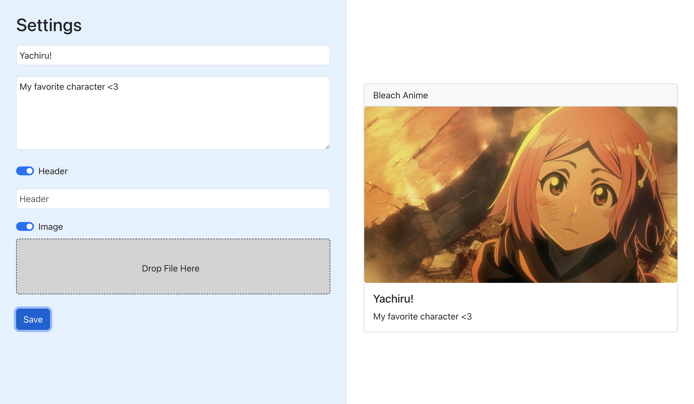

**Post Editor** is an application for creating and previewing posts

<code>[Let's try it!](https://react-test-task-1v10423nx-lisagontsova-gmailcom.vercel.app/)</code> 

**About it.** You can create a post consisting of a header, title, text and image - and see the result in preview mode. The title and text of the post are required fields, while the header and image are fields of your choice. The "save" button will save the post you created

